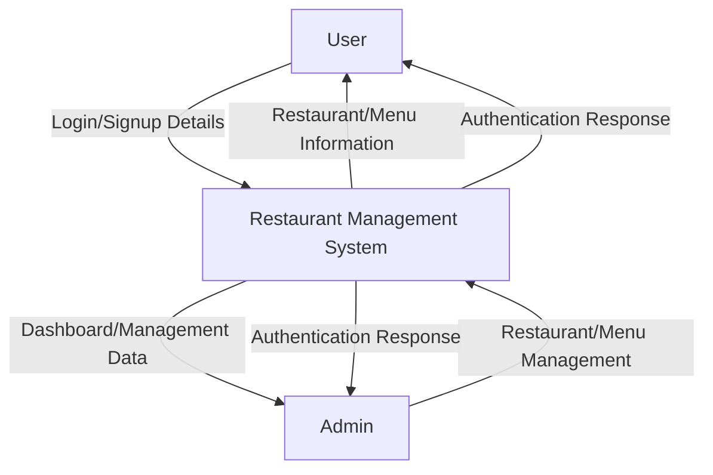
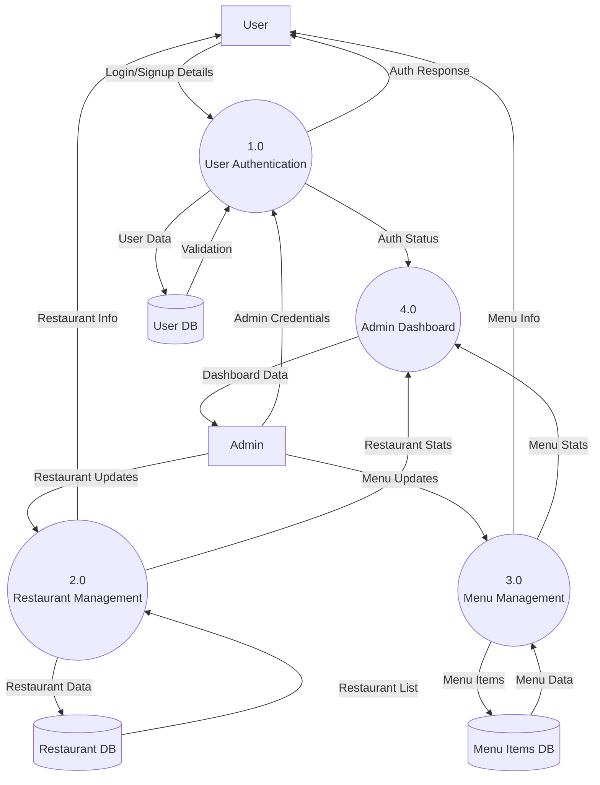
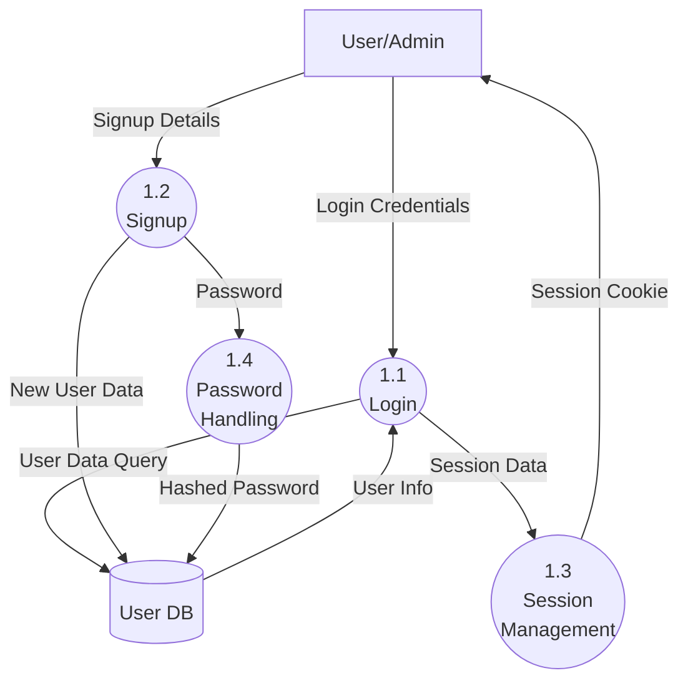
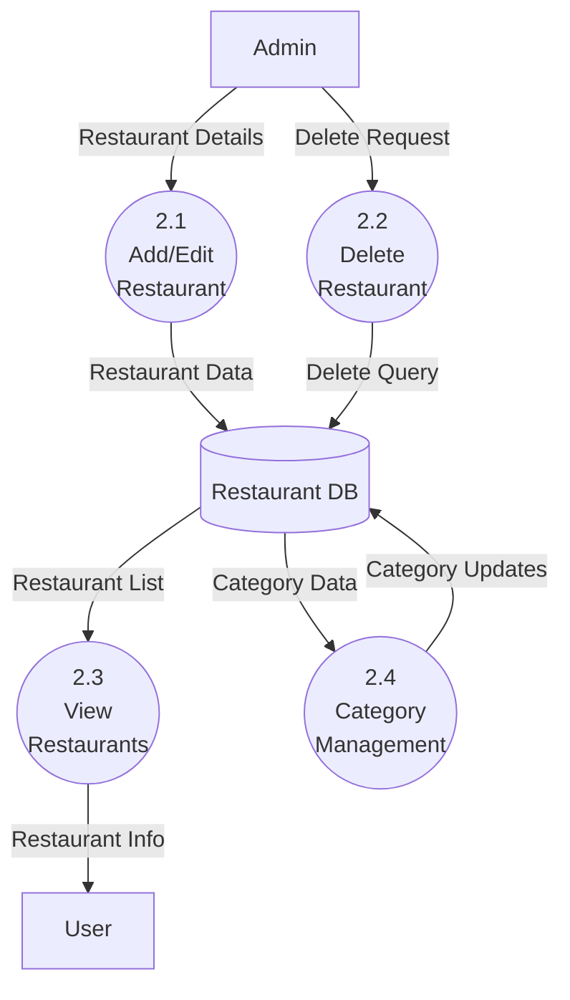
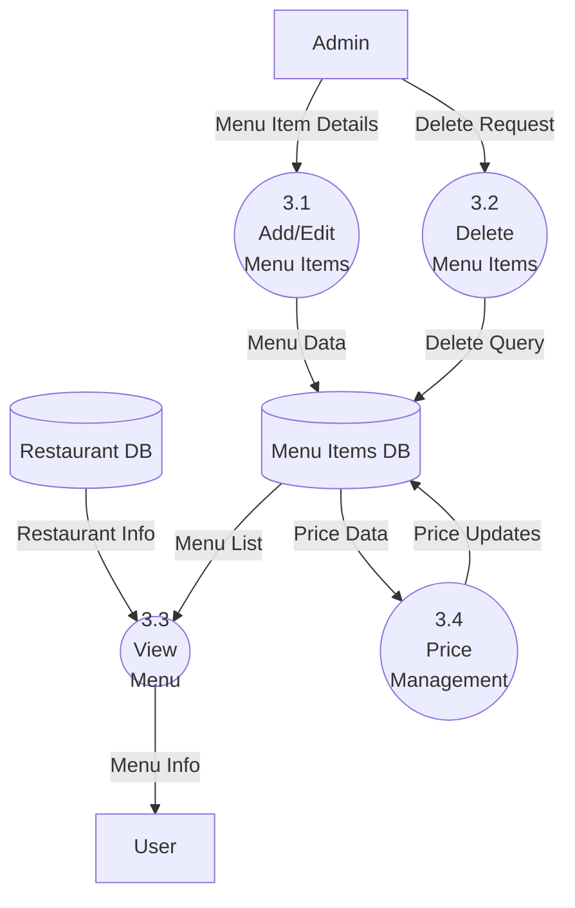

# Restaurant Management System - Data Flow Diagrams

## Context Diagram (Level 0)

## Level 1 DFD

## Level 2 DFD - User Authentication Process (1.0)

## Level 2 DFD - Restaurant Management Process (2.0)

## Level 2 DFD - Menu Management Process (3.0)

The above Data Flow Diagrams represent:

1. **Context Diagram (Level 0)**: Shows the system's interaction with external entities (Users and Admins)
2. **Level 1 DFD**: Breaks down the main system into major processes and shows data stores
3. **Level 2 DFDs**: Detailed breakdown of major processes:
   - User Authentication Process (1.0)
   - Restaurant Management Process (2.0)
   - Menu Management Process (3.0)

Key Components:
- **Processes**: Shown as circles/ovals
- **External Entities**: Shown as rectangles
- **Data Stores**: Shown as open-ended rectangles
- **Data Flows**: Shown as arrows with descriptions
